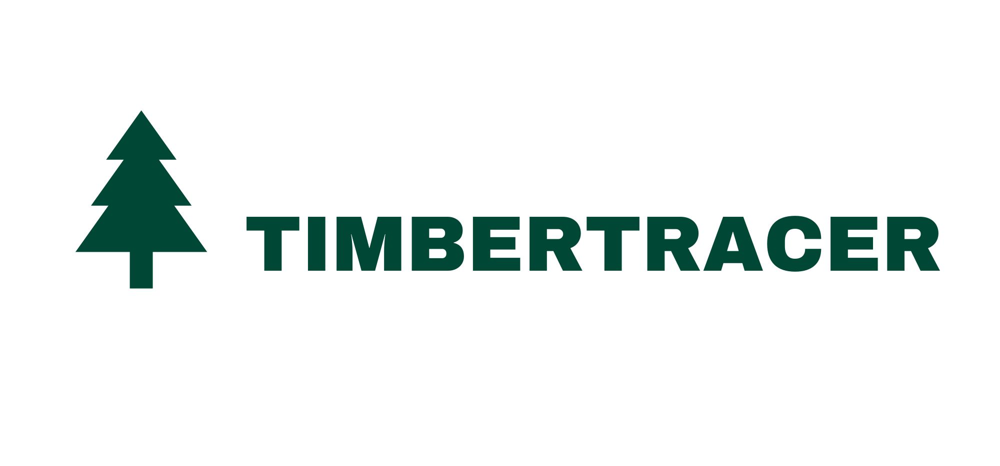

# TimberTracer: A Comprehensive Framework for the Evaluation of Carbon Sequestration by Forest Management and Substitution of Harvested Wood Products.

{width=40%}

## Overview

This Python-based model offers a comprehensive analysis of wood products, emphasizing the factors influencing carbon pools, emissions, and the temporal dynamics associated with harvested wood products. Its primary goal is to provide insights into both carbon sequestration and emissions over time. For more information, read the paper published at https://doi.org/ [DOI will be available after publication]

## Features

- **Carbon Sequestration Analysis**: Assess the amount of carbon stored in various wood products.
- **Emission Dynamics**: Understand the emissions associated with different stages of wood product utilization.
- **Substitution effect**: Evaluate the substitution of fossil fuel and energy-intensive materials.
- **Temporal Insights**: Examine how carbon sequestration and emissions evolve over time.
- **Modular Design**: Easily extend or modify components to adapt to specific research needs.

## Requirements

- Python 3.x
- Additional libraries listed in requirements.txt

## Installation

1. Clone the repository
2. Navigate to the project directory:
	```bash
	cd timbertracer/
	```
3. Install the required packages:
	```bash
	pip install -r requirements.txt
	```

## Usage

1.  **Configuration**: Modify the variables in the `config.py` file to customize the analysis parameters according to your requirements.
    
2.  **Data Preparation**: Ensure your wood product data is formatted according to the provided examples. TimberTracer can be seamlessly coupled with any forest growth model, whether individual-tree or stand-based level, such as Go+ (Moreaux et al., 2020) or 3DCMCC-FEM (Collalti et al., 2014).

3.  **Data Input**: Modify `__main.py__` to include your parameters in the `app.run_model()` function.
    
4.  **Run the Model**: Execute the main script to initiate the analysis: 	```bash python main.py``` 
    
    
5.   **Computational Notebook**: Access the [Google Colab notebook](https://linnk.com) that demonstrates the usage of the model, step-by-step analysis, and interpretation of results.
